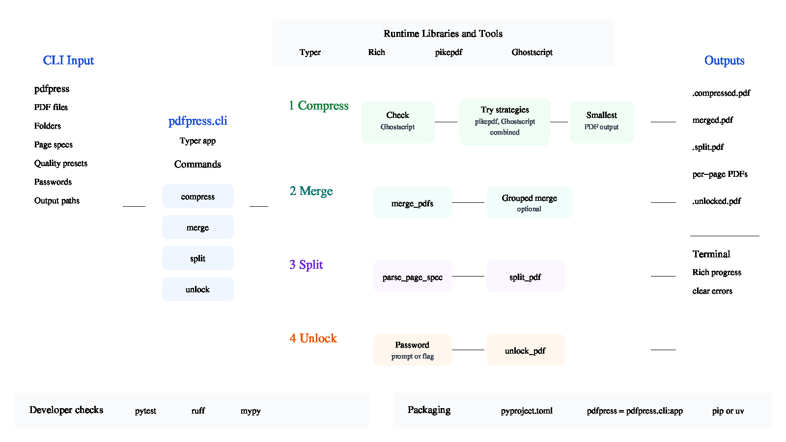

<div align="center">
  

  **🔧 Compress, merge, split, and unlock PDF files with one tool ⚡**
</div>

pdfpress is a Python command-line toolkit for everyday PDF maintenance. Use it to shrink large PDFs, combine files, extract selected pages, or remove password protection from encrypted PDFs you can open.

It installs as the `pdfpress` command and is built with Typer, Rich, pikepdf, and Ghostscript.

## Install

Install from PyPI:

```bash
uv tool install pdfpress
```

Or install from this repository for development:

```bash
git clone https://github.com/tsilva/pdfpress.git
cd pdfpress
uv pip install -e ".[dev]"
```

Run the CLI:

```bash
pdfpress --help
```

## Commands

```bash
pdfpress compress document.pdf                  # create document.compressed.pdf
pdfpress compress *.pdf -j 4 -Q screen         # batch compress with 4 workers
pdfpress compress document.pdf -o small.pdf    # write a specific output file
pdfpress compress *.pdf -d compressed/         # write batch output to a directory

pdfpress merge dir/                            # merge all PDFs in a directory
pdfpress merge f1.pdf f2.pdf -o out.pdf        # merge explicit files
pdfpress merge dir/ --grouped                  # merge groups such as report-1/report-2

pdfpress split document.pdf -p "1,3,5"         # extract specific pages
pdfpress split document.pdf -p "1-5" -o out.pdf
pdfpress split document.pdf -p "all" -i -d out/

pdfpress unlock dir/                           # prompt once and unlock matching PDFs
pdfpress unlock file.pdf -p "secret"           # pass the password on the command line
pdfpress unlock file.pdf -o unlocked.pdf       # write a specific output file

pytest                                         # run tests
ruff check src/                                # lint source
mypy src/                                      # type-check source
```

## Notes

- Python 3.10 or newer is required.
- Ghostscript (`gs`) must be installed on the system for `pdfpress compress`.
- Compression tries pikepdf, Ghostscript, and a combined strategy, then keeps the smallest successful output.
- Batch compression can use multiple processes with `--jobs`; use `--jobs 1` for sequential processing.
- `compress --in-place` replaces original files after a successful smaller output is produced.
- `merge --grouped` groups files by base name after removing trailing numeric suffixes such as `-1` or `_2`.
- `split --pages` accepts page lists, ranges, `all`, `odd`, and `even`.
- `unlock` writes unlocked files as `*.unlocked.pdf` unless `--output` or `--output-dir` is provided.

## Architecture



## License

[MIT](LICENSE)
